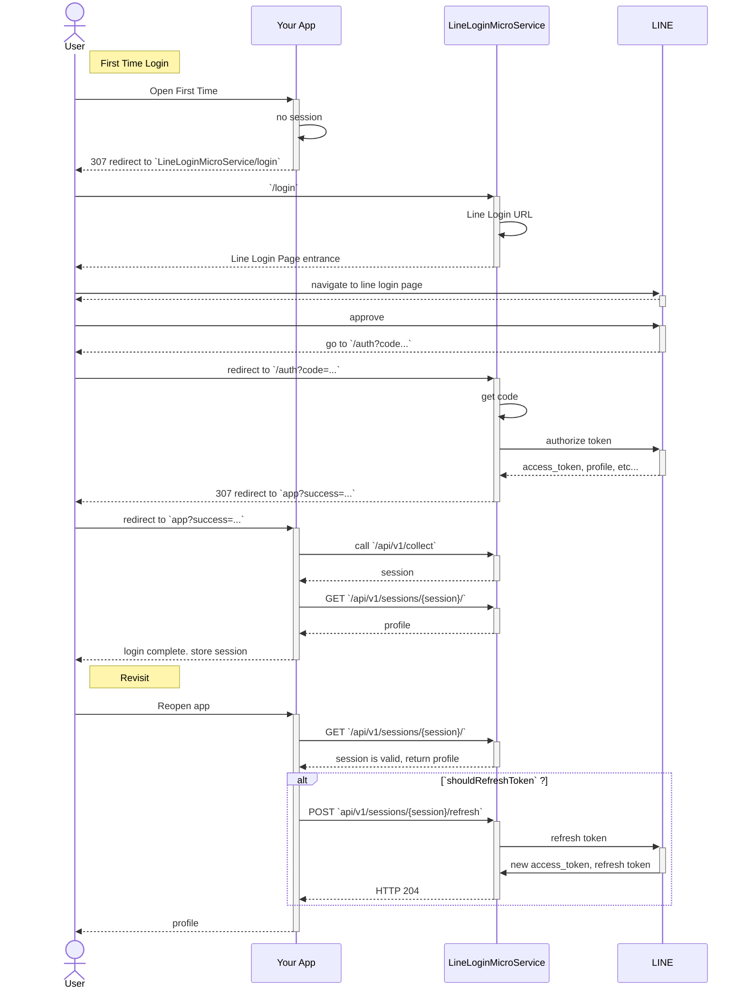

# LineLoginMicroService

## Setup

### build image


```sh
docker compose build
```

### Initialize database


```sh
sh setup_pocketbase.sh
```

## Serve


```sh
docker compose up
```


## Flow diagram


